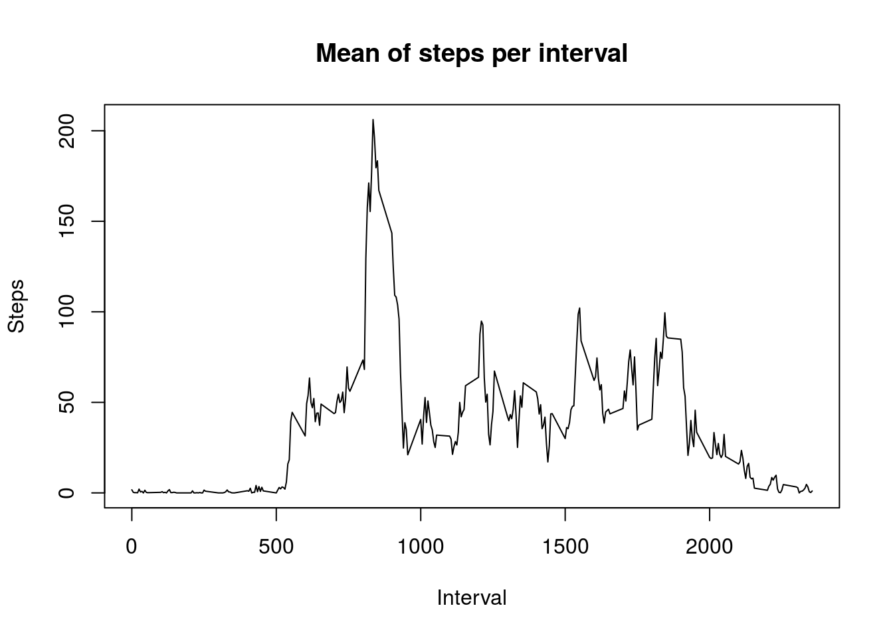
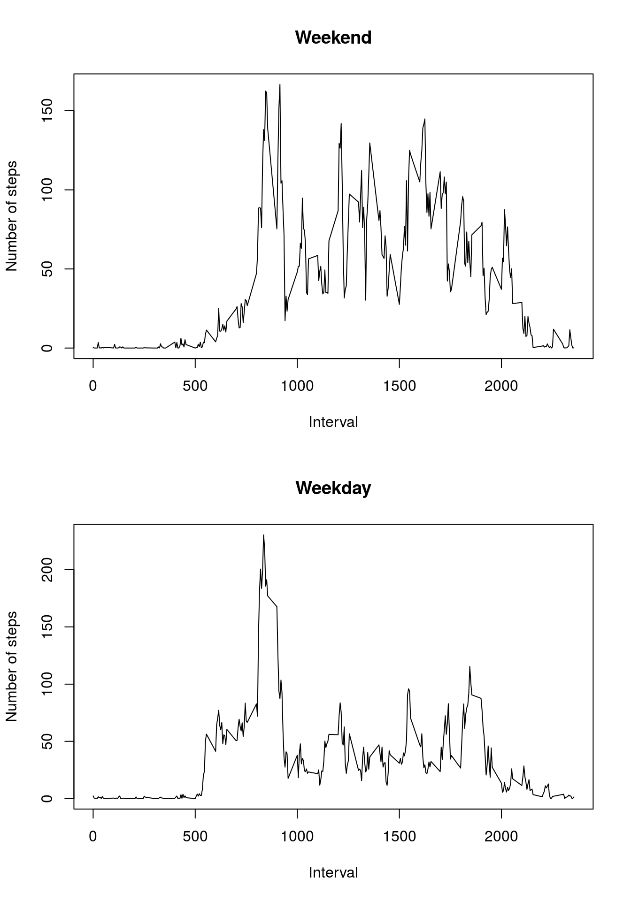

# Week 2 assigment


## Loading the data

First we import the data.


```r
activity <- read.csv('activity.csv', colClasses = c('integer', 'Date', 'integer'))
str(activity)
```

```
## 'data.frame':	17568 obs. of  3 variables:
##  $ steps   : int  NA NA NA NA NA NA NA NA NA NA ...
##  $ date    : Date, format: "2012-10-01" "2012-10-01" ...
##  $ interval: int  0 5 10 15 20 25 30 35 40 45 ...
```

## Creating a table with number of steps per day

After that we create a dataframe with the sum of steps per day.


```r
hist_act <- aggregate(activity$steps, by=list(activity$date), sum, na.rm = TRUE)
colnames(hist_act) <- c('date', 'steps')
str(hist_act)
```

```
## 'data.frame':	61 obs. of  2 variables:
##  $ date : Date, format: "2012-10-01" "2012-10-02" ...
##  $ steps: int  0 126 11352 12116 13294 15420 11015 0 12811 9900 ...
```

## Ploting the histogram of steps per day

We plot the histogram of steps per day.


```r
hist(hist_act$steps, xlab = 'Steps', main = 'Frequency of steps per day')
```


## Calculating the mean of steps per day


```r
mean(hist_act$steps, na.rm = TRUE)
```

```
## [1] 9354.23
```

## Calculating the median of steps per day


```r
median(hist_act$steps, na.rm = TRUE)
```

```
## [1] 10395
```

## Creating a table with the mean of steps per interval

We create another dataframe with the mean of steps per interval.


```r
act_5_min <- aggregate(activity$steps, by=list(activity$interval), mean, na.rm = TRUE)
colnames(act_5_min) <- c('interval', 'steps')
str(act_5_min)
```

```
## 'data.frame':	288 obs. of  2 variables:
##  $ interval: int  0 5 10 15 20 25 30 35 40 45 ...
##  $ steps   : num  1.717 0.3396 0.1321 0.1509 0.0755 ...
```

## Ploting the data

Ploting the mean of steps per interval.


```r
plot(act_5_min$interval, act_5_min$steps, type = 'l', xlab = 'Interval', ylab = 'Steps', main = 'Mean of steps per interval')
```



## Showing the interval with the highest mean of steps

We can show the interval with the max average of steps.


```r
act_5_min[act_5_min$steps == max(act_5_min$steps),]
```

```
##     interval    steps
## 104      835 206.1698
```


## Calculating the number of measures um NA values


```r
sum(is.na(activity$steps))
```

```
## [1] 2304
```

## Substituting the NA

For the next part we need to substitute the NA steps values for the mean of steps for that interval


```r
for(i in 1:length(activity[,1])) {
    if(is.na(activity[i,1])) {
        activity[i,1] <- mean(act_5_min[act_5_min$interval == activity[i,3],2], na.rm = TRUE)
    }
}
str(activity)
```

```
## 'data.frame':	17568 obs. of  3 variables:
##  $ steps   : num  1.717 0.3396 0.1321 0.1509 0.0755 ...
##  $ date    : Date, format: "2012-10-01" "2012-10-01" ...
##  $ interval: int  0 5 10 15 20 25 30 35 40 45 ...
```

After that we must recalcultate the number of steps per day


```r
hist_act <- aggregate(activity$steps, by=list(activity$date), sum, na.rm = TRUE)
colnames(hist_act) <- c('date', 'steps')
str(hist_act)
```

```
## 'data.frame':	61 obs. of  2 variables:
##  $ date : Date, format: "2012-10-01" "2012-10-02" ...
##  $ steps: num  10766 126 11352 12116 13294 ...
```

## Mean of steps per day

Now we will calculate the mean of steps per day for the new table


```r
mean(hist_act$steps, na.rm = TRUE)
```

```
## [1] 10766.19
```

## Median of steps per day

Now we will calculate the median of steps per day for the new table 


```r
median(hist_act$steps, na.rm = TRUE)
```

```
## [1] 10766.19
```

## Ploting steps per day

With the new number of steps per day we can plot the histogram


```r
hist(hist_act$steps, xlab = 'Steps', main = 'Frequency of steps per day')
```


## Aggregating the data by weekday or weekend

We will create a vector with the information if the measure was taken on a weekday or a weekend.


```r
activity$week <- factor(ifelse(weekdays(activity$date,abbreviate = TRUE) == 'Sat' | weekdays(activity$date,abbreviate = TRUE) == 'Sun', 'Weekend', 'Weekday'))
```

After that we will aggregate the data for the ploting

```r
act_5_min_week <- aggregate(activity$steps, by=list(activity$interval, activity$week), mean, na.rm = TRUE)
colnames(act_5_min_week) <- c('interval', 'week', 'steps')
act_5_min_week$interval <- as.integer(act_5_min_week$interval)
str(act_5_min_week)
```

```
## 'data.frame':	576 obs. of  3 variables:
##  $ interval: int  0 5 10 15 20 25 30 35 40 45 ...
##  $ week    : Factor w/ 2 levels "Weekday","Weekend": 1 1 1 1 1 1 1 1 1 1 ...
##  $ steps   : num  2.251 0.445 0.173 0.198 0.099 ...
```

## Ploting the data


```r
par(mfrow=c(2,1))
plot(x = act_5_min_week[act_5_min_week$week == 'Weekend', 'interval'], y = act_5_min_week[act_5_min_week$week == 'Weekend', 'steps'], type = "l", main = 'Weekend', xlab = 'Interval', ylab = 'Number of steps')
plot(x = act_5_min_week[act_5_min_week$week == 'Weekday', 'interval'], y = act_5_min_week[act_5_min_week$week == 'Weekday', 'steps'], type = "l", main = 'Weekday', xlab = 'Interval', ylab = 'Number of steps')
```


